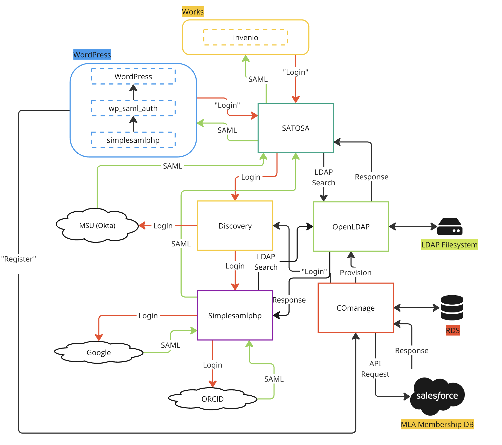

# Knowledge Commons IDMS

**_This stack is currently in development and is not suitable for production use._**

The Knowledge Commons IDMS stack is responsible for managing the identity and access management system for the [Knowledge Commons](https://kcommons.org). It is developed by [Mesh Research](https://meshresearch.commons.msu.edu/) at [Michigan State University](https://msu.edu).

This repository is open source but it is not intended as a general-purpose distributable application. It is specific to Knowledge Commons. Code can be used and adapted according to the terms of our [License](LICENSE.md), but we do not recommend using this stack outside of the context of the Knowledge Commons network.

## Architecture

The Knowledge Commons IDMS stack consists of the following central services:

- SATOSA --- Acts as a proxy between the IDMS stack and KC applications
- COmanage --- Application for managing identities and interfacing with external membership systems.
- Discovery --- Interface for users to choose authentication methods
- SimplesamlPHP --- Handles user authentication and serves as gateway for external identity providers
- OpenLDAP --- Intermediary between COmanage and SimplesamlPHP / SATOSA

Additionally, for local development, the "SP" service exists as a stand-in for applications such as KC Works, KC Profiles, and Knowledge Commons WordPress.

Each service exists in a subdirectory. Additionally:

- `docs`: Developer documentation
- `playwright`: End-to-end tests
- `scripts`: general-purpose dev-ops scripts

## Contributing

Please see [Contributing](docs/contributing.md) for development instructions and practices.
